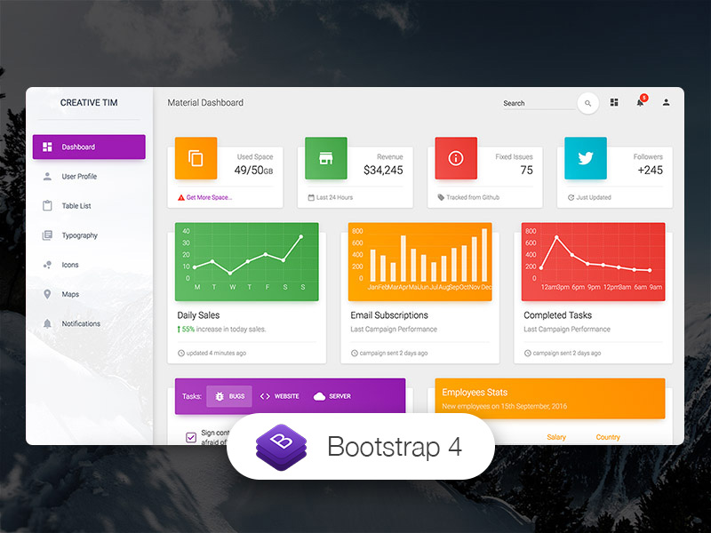

# Dashboard - EOI

## Objective

We were asked to recreate a dashboard website from scratch using the css layout techniques we wished.

## Inspiration

## Tools

The aim of this exercise is to review flexbox, CSS-Grid and positioning techniques.

I have used FontAwesome5 for the icons.
